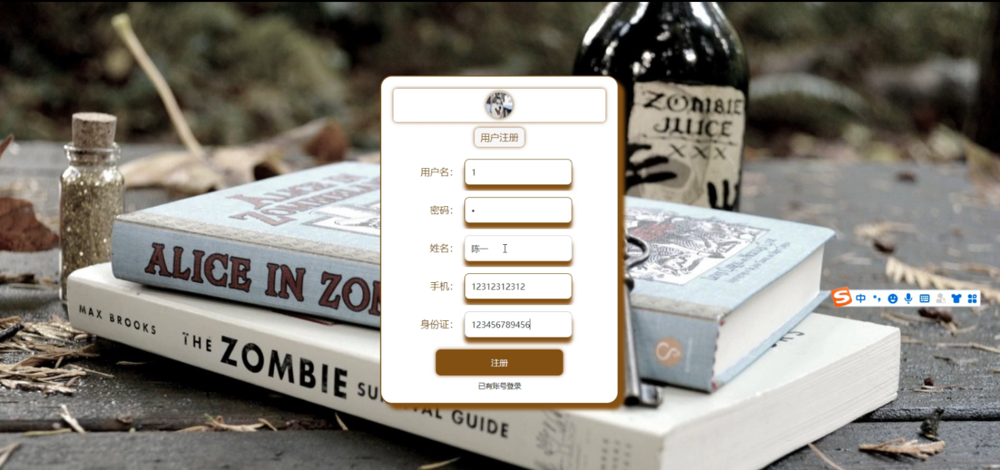

## 基于SpringBoot的阿博图书馆管理系统(程序+报告)

###  获取sql数据库文件: 从戎源码网 (https://armycodes.com/) QQ: 386869957 QQ群: 377586148
###  所有系统地址: (https://github.com/YuLin-Coder/AllProjectCatalog) 
###  所有项目以及源代码本人均调试运行无问题 可支持远程安装部署调试、定制修改、代码讲解

## 项目介绍
基于SpringBoot的阿博图书馆管理系统，系统包含两种角色：用户、管理员，系统分为前台和后台两大模块，主要功能如下：

### 【管理员】:
- 管理员登录  
  管理员通过填写用户名、密码、角色进行登录。

- 管理员功能界面  
  管理员登录后可以访问首页、个人中心、用户管理、图书分类管理、图书信息管理、图书借阅管理、图书归还管理、缴纳罚金管理、留言板管理、系统管理等功能。

- 用户管理  
  管理员可以查看用户名、姓名、性别、头像、手机、身份证等信息，并进行详情查看、修改或删除操作。

- 图书分类管理  
  管理员可以查看图书分类信息，并进行详情查看、修改或删除操作。

- 图书信息管理  
  管理员可以查看图书编号、图书名称、图书分类、图片、作者、出版社、图书状态、可借天数、可借数量等信息，并进行详情查看、修改、查看评论或删除操作。

- 图书借阅管理  
  管理员可以查看借阅单号、图书编号、图书名称、图书分类、图片、可借天数、借阅日期、借阅天数、应还日期、借阅状态、用户名、姓名、手机、身份证、审核回复、审核状态等信息，并进行详情查看、修改等操作。

- 缴纳罚金管理  
  管理员可以查看借阅单号、图书编号、图书名称、罚款说明、罚款金额、罚款日期、用户名、手机、是否支付等信息，并进行详情查看、修改或删除操作。

- 轮播图管理  
  管理员可以管理首页的轮播图，进行图片的新增、修改或删除操作。

### 【用户】:
- 用户登录  
  用户登录后可以访问首页、个人中心、图书借阅管理、图书归还管理、缴纳罚金管理、我的收藏管理等功能。

- 图书归还管理  
  用户可以查看借阅单号、图书编号、图书名称、图书分类、图片、可借天数、借阅日期、应还日期、归还日期、用户名、手机、审核回复、审核状态等信息，并进行详情查看、修改或删除操作。

### 【前台】:
- 首页  
  用户可以查看系统首页、图书信息、公告信息、留言反馈、个人中心、后台管理等内容。

- 用户注册与登录  
  用户通过注册页面填写用户名、密码、姓名、性别、手机、身份证等信息进行注册，并通过登录页面进行登录操作。

- 图书信息  
  用户可以查看图书编号、图书名称、图书分类、图片、作者、出版社、图书状态、可借天数、可借数量、点击次数等信息，并进行借阅或收藏操作。

- 个人中心  
  用户可以在个人中心更新用户名、密码、姓名、性别、头像、手机、身份证等信息，并进行退出登录操作。

- 留言反馈  
  用户可以填写留言内容、回复内容、用户名等信息进行提交。

## 项目技术
- 编程语言：Java
- 数据库：MySQL
- 项目管理工具：Maven
- 前端技术：HTML、CSS、JavaScript、Jquery、Vue
- 后端技术：Spring、SpringMVC、MyBatis

## 运行环境
- JDK版本：JDK1.8及以上
- 开发工具：IDEA、Ecplise、Myecplise都可以
- 数据库: MySQL5.7及以上
- Maven：maven3.0及以上
- Node：14.14.0及以上

## 运行截图

